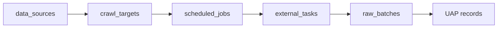
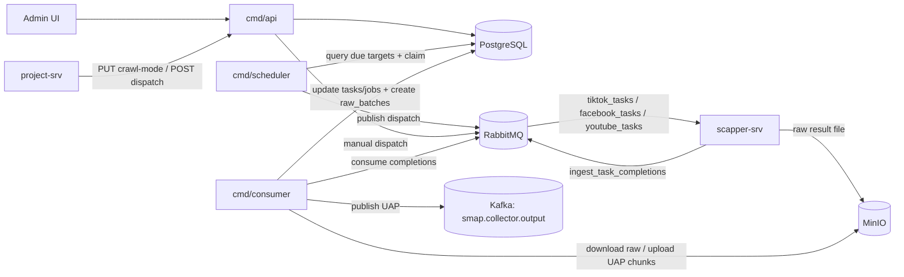
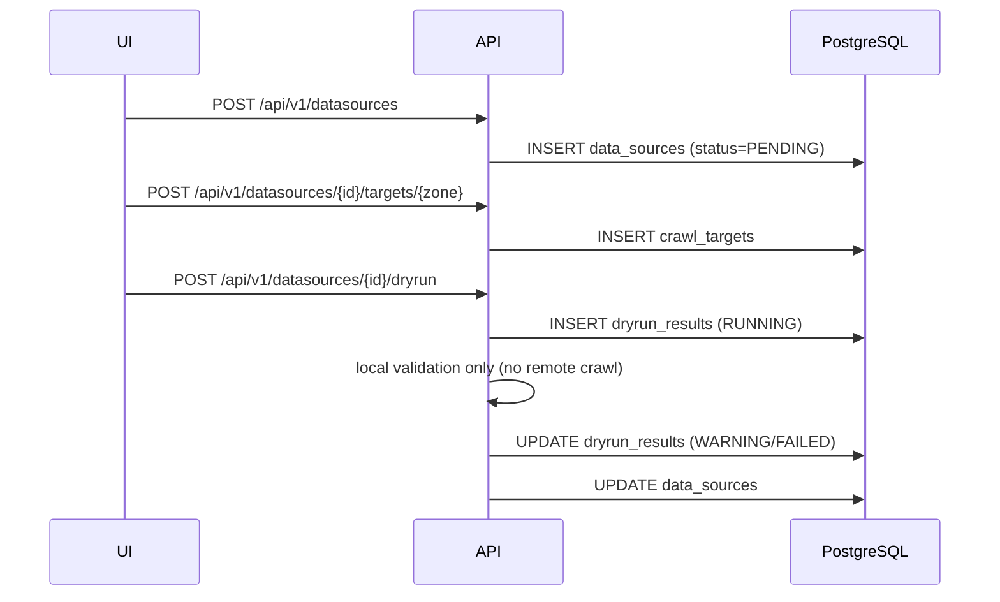
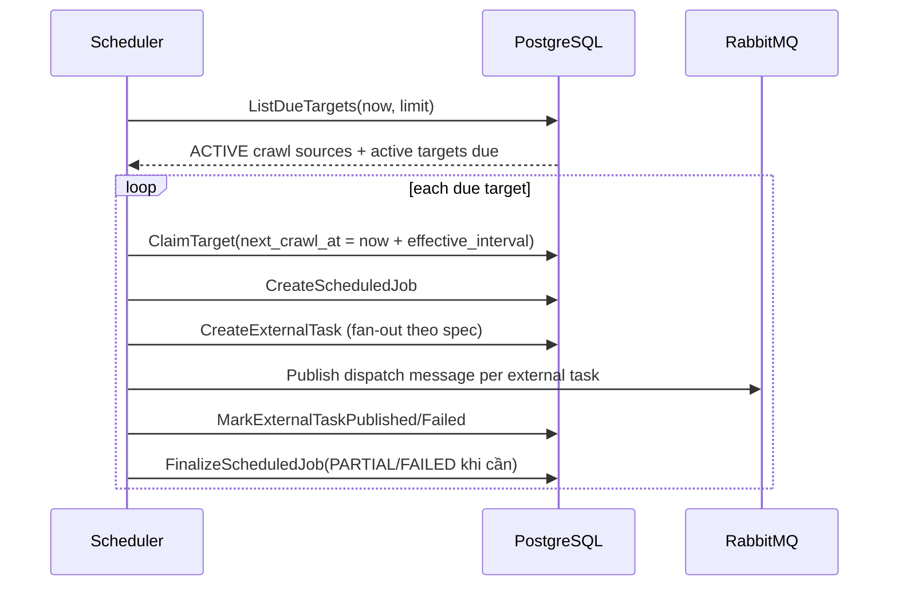
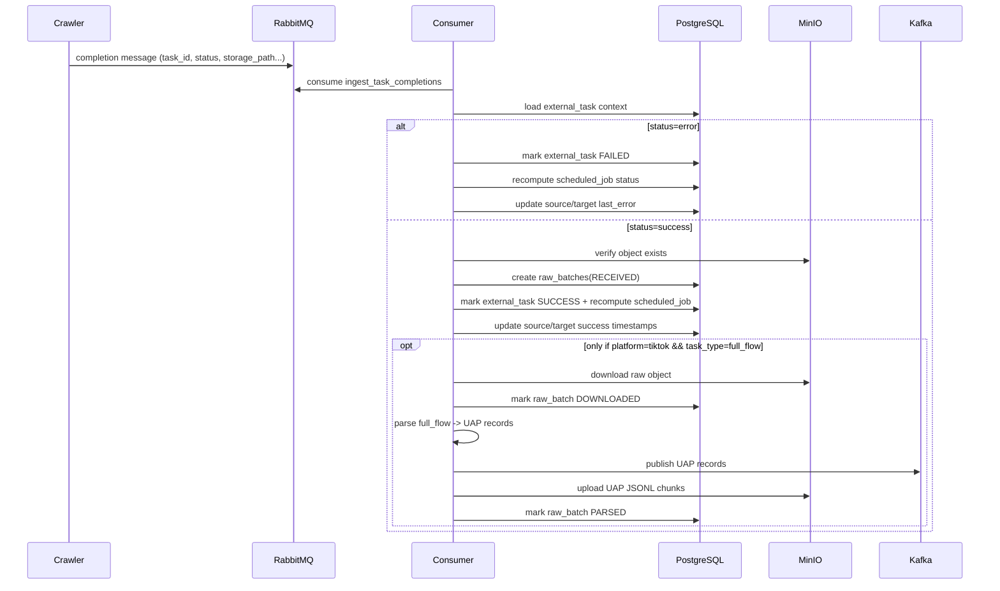

# dispatcher-srv (ingest-srv)

SMAP Dispatcher/Ingest Service.

Service này quản lý datasource/target, điều phối runtime crawl, nhận completion từ crawler, lưu raw batch, parse sang UAP và publish downstream.

## Mục lục

- Tổng quan
- Boundary và ownership
- Thành phần runtime
- Kiến trúc module hiện tại
- Data model cốt lõi
- API contract hiện tại
- Dataflow hoàn chỉnh
- Dispatch mapping đang hỗ trợ
- Business rules đang enforce trong code
- Trạng thái hiện tại
- Run và config

## Tổng quan

`ingest-srv` hiện có 3 tiến trình chính:

1. `cmd/api`: control-plane API cho datasource/target/dryrun + internal orchestration endpoints
2. `cmd/scheduler`: tick cron, chọn target đến hạn, dispatch task sang RabbitMQ
3. `cmd/consumer`: consume completion từ RabbitMQ, tạo raw batch, parse/publish UAP

## Boundary và ownership

### Ingest sở hữu

- `data_sources`
- `crawl_targets`
- `dryrun_results`
- `scheduled_jobs`
- `external_tasks`
- `raw_batches`
- `crawl_mode_changes`

### Ingest không sở hữu

- `projects`
- `campaigns`
- `project_crisis_config`
- quyết định business-level lifecycle project

Các phần trên thuộc `project-srv`.

## Thành phần runtime

| Thành phần | Vai trò |
|---|---|
| `project-srv` | gọi internal API đổi crawl mode / orchestration |
| `scapper-srv` (crawler) | nhận task từ queue platform, trả completion về queue ingest |
| `PostgreSQL` | persistence cho control plane và runtime lineage |
| `RabbitMQ` | task dispatch + completion ingest |
| `MinIO` | lưu raw kết quả crawler, lưu UAP chunk artifacts |
| `Kafka` | publish UAP record downstream |
| `Redis` | dependency hạ tầng (ready check/core infra) |

## Kiến trúc module hiện tại

| Module | Trách nhiệm |
|---|---|
| `internal/httpserver` | wiring routes, middleware, health/readiness/liveness |
| `internal/datasource` | CRUD datasource + grouped crawl target + update crawl mode |
| `internal/dryrun` | dryrun control-plane (validation-only), latest/history |
| `internal/execution` | dispatch usecase, completion handling, scheduler integration |
| `internal/scheduler` | cron tick `dispatch_due_targets` |
| `internal/consumer` | consume completion queue và nối sang parser UAP |
| `internal/uap` | parse TikTok full_flow raw -> UAP, upload chunk MinIO, publish Kafka |
| `internal/model` | enum/domain model dùng chung |
| `internal/sqlboiler` | DB models generated |

## Data model cốt lõi

Lineage runtime chính:



Ghi chú:

- Scheduler chạy theo `crawl_targets.next_crawl_at` (per-target).
- `data_sources.crawl_interval_minutes` hiện đóng vai trò default/config level; interval thực tế dispatch lấy từ target + crawl mode multiplier.

## API contract hiện tại

### Public API (`/api/v1`)

Tất cả endpoint dưới đây dùng `Auth()` middleware.

| Method | Path | Mục đích |
|---|---|---|
| `POST` | `/datasources` | tạo datasource |
| `GET` | `/datasources` | list datasource |
| `GET` | `/datasources/:id` | detail datasource |
| `PUT` | `/datasources/:id` | update datasource |
| `DELETE` | `/datasources/:id` | archive datasource |
| `POST` | `/datasources/:id/targets/keywords` | tạo grouped keyword target |
| `POST` | `/datasources/:id/targets/profiles` | tạo grouped profile target |
| `POST` | `/datasources/:id/targets/posts` | tạo grouped post target |
| `GET` | `/datasources/:id/targets` | list targets |
| `GET` | `/datasources/:id/targets/:target_id` | detail target |
| `PUT` | `/datasources/:id/targets/:target_id` | update target |
| `DELETE` | `/datasources/:id/targets/:target_id` | delete target |
| `POST` | `/datasources/:id/dryrun` | trigger dryrun |
| `GET` | `/datasources/:id/dryrun/latest` | lấy dryrun latest |
| `GET` | `/datasources/:id/dryrun/history` | lấy dryrun history |

### Internal API (`/api/v1/ingest`)

Tất cả endpoint internal dùng `InternalAuth()`.

| Method | Path | Mục đích |
|---|---|---|
| `GET` | `/ping` | ingest ping |
| `PUT` | `/datasources/:id/crawl-mode` | đổi crawl mode + ghi audit `crawl_mode_changes` |
| `POST` | `/datasources/:id/targets/:target_id/dispatch` | manual dispatch một target |

### System routes

| Method | Path | Mục đích |
|---|---|---|
| `GET` | `/health` | health |
| `GET` | `/ready` | readiness |
| `GET` | `/live` | liveness |
| `GET` | `/swagger/*any` | swagger UI |

## Dataflow hoàn chỉnh

### 1) End-to-end tổng thể



### 2) Control-plane flow (Datasource + Target + Dryrun)



Dryrun hiện tại là control-plane only:

- pass -> trả `WARNING` với warning code `control_plane_only_no_remote_execution`
- fail -> `FAILED`
- không tạo `external_tasks`, không publish RabbitMQ

### 3) Scheduler dispatch flow



`effective_interval` hiện tính theo:

- `target.crawl_interval_minutes * mode_multiplier`
- `mode_multiplier`: `CRISIS=0.2`, `NORMAL=1.0`, `SLEEP=5.0`
- clamp trong `[1, 1440]` phút

### 4) Completion -> Raw batch -> UAP flow



Idempotency chính:

- duplicate completion `success` với cùng `(source_id, batch_id)` được skip
- duplicate completion `error` khi task đã terminal được skip
- unknown `task_id` được ignore

## Dispatch mapping đang hỗ trợ

`execution.usecase.buildDispatchSpecs` hiện hỗ trợ:

| Source Type | Target Type | Queue | Action | Fan-out |
|---|---|---|---|---|
| `TIKTOK` | `KEYWORD` | `tiktok_tasks` | `full_flow` | 1 task / keyword trong `values[]` |
| `FACEBOOK` | `POST_URL` | `facebook_tasks` | `post_detail` | 1 task / target (cần `platform_meta.parse_ids`) |

Chưa có mapping runtime cho:

- `PROFILE` targets
- `YOUTUBE` targets
- nhiều tổ hợp source/target khác

## Business rules đang enforce trong code

### Datasource / Target

- datasource mới luôn `PENDING`
- `CRAWL` source bắt buộc có `crawl_mode` và `crawl_interval_minutes > 0`
- chỉ `CRAWL` source mới tạo được target
- target `PROFILE`/`POST_URL` bắt buộc URL hợp lệ
- update `config`/`mapping_rules` bị chặn nếu source đang `ACTIVE`
- archive datasource là soft-delete (đặt `deleted_at`, status=`ARCHIVED`)

### Dryrun

- chỉ cho source trạng thái `PENDING` hoặc `READY`
- với source `CRAWL`, bắt buộc `target_id`
- với source `PASSIVE`, không cho truyền `target_id`

### Runtime

- scheduler chỉ chọn source `ACTIVE` + target `is_active=true` + due theo `next_crawl_at`
- dispatch tạo lineage: `scheduled_job` -> `external_task`
- completion success/error cập nhật lại `external_task`, `scheduled_job`, `data_sources`, `crawl_targets`
- parser UAP chỉ chạy cho `tiktok + full_flow`

## Trạng thái hiện tại

### Đã chạy được

- datasource CRUD + grouped target CRUD
- dryrun trigger/latest/history (validation-only)
- internal crawl-mode update + audit trail
- scheduler dispatch due targets
- manual dispatch target qua internal API
- consume completion từ RabbitMQ
- tạo `raw_batches` và parse/publish UAP cho TikTok full_flow

### Chưa hoàn chỉnh / chưa wire đủ

- lifecycle API `Activate/Pause/Resume` đã có usecase nhưng chưa expose route HTTP
- dryrun chưa chạy remote runtime thật (chỉ local validation)
- dispatch mapping còn giới hạn (chủ yếu TikTok keyword, Facebook post detail)
- UAP parser hiện tập trung TikTok full_flow, chưa generic cho các platform/action khác

## Run và config

## Local run

```bash
make run-api
make run-consumer
make run-sched
```

## Local run với file config riêng

```bash
make run-api-local
make run-consumer-local
make run-scheduler-local
```

## Cấu hình

- mặc định đọc `config/ingest-config.yaml`
- có thể override bằng env `INGEST_CONFIG_FILE`
- file mẫu: `config/ingest-config.example.yaml`

## Docker infra (local)

```bash
docker compose up -d
```

Stack local gồm: PostgreSQL, Redis, MinIO, Kafka (KRaft), RabbitMQ.

## Migrations

- `migrations/001_create_schema_ingest_v1.sql`: tạo schema + enums + tables + indexes
- `migrations/002_seed_ingest_defaults.sql`: seed mode defaults
- `migrations/003_refactor_crawl_targets_to_grouped_values.sql`: refactor target values
