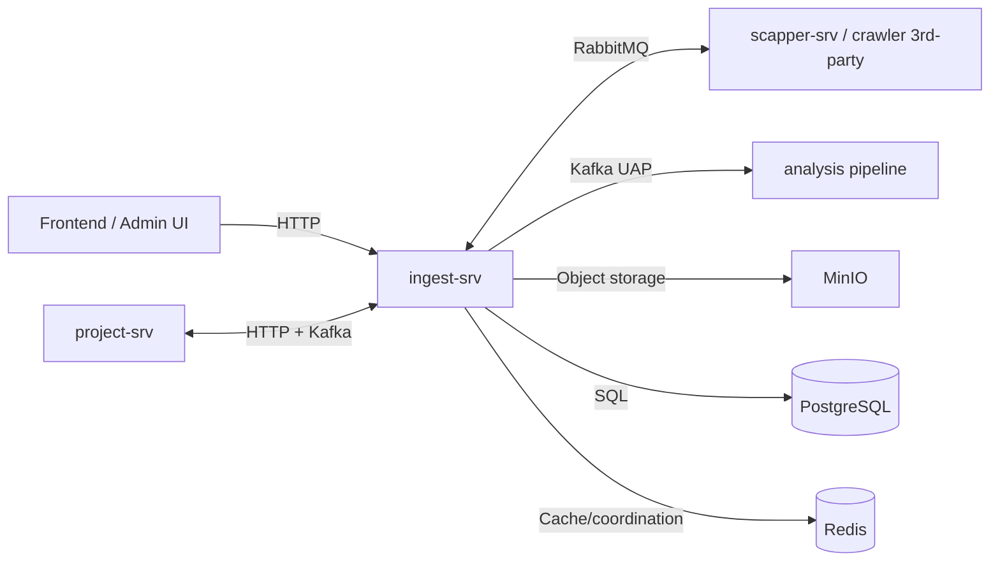
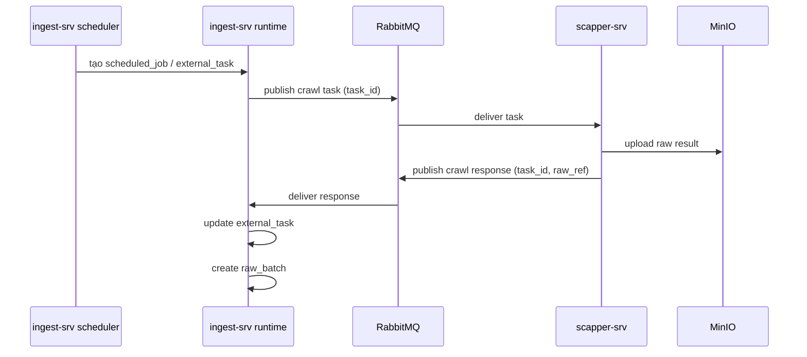
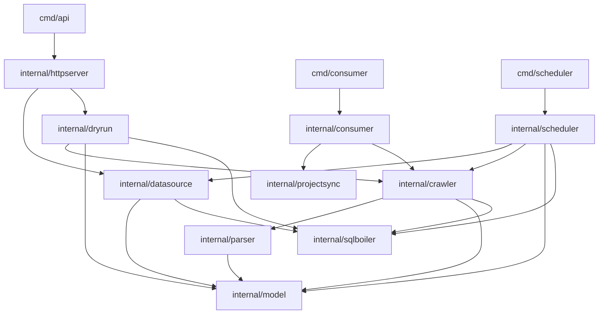
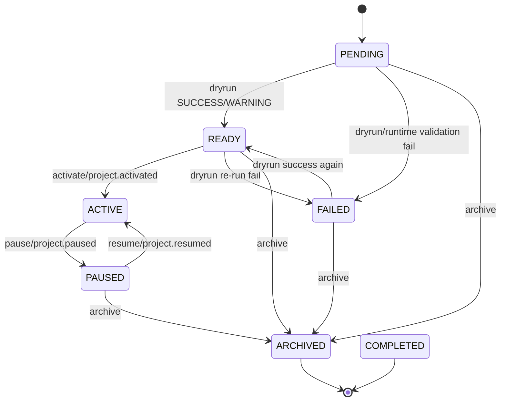
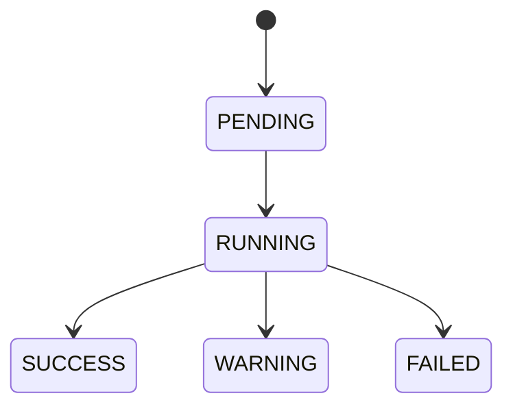
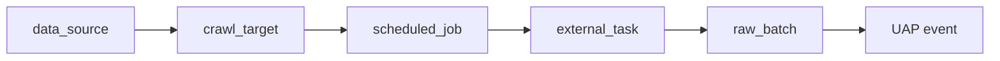
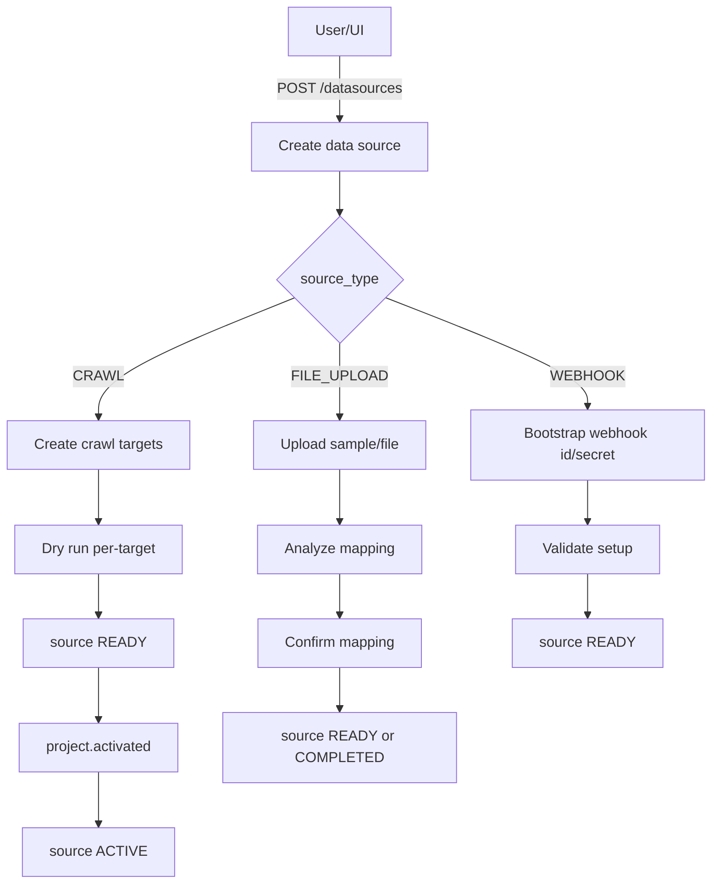
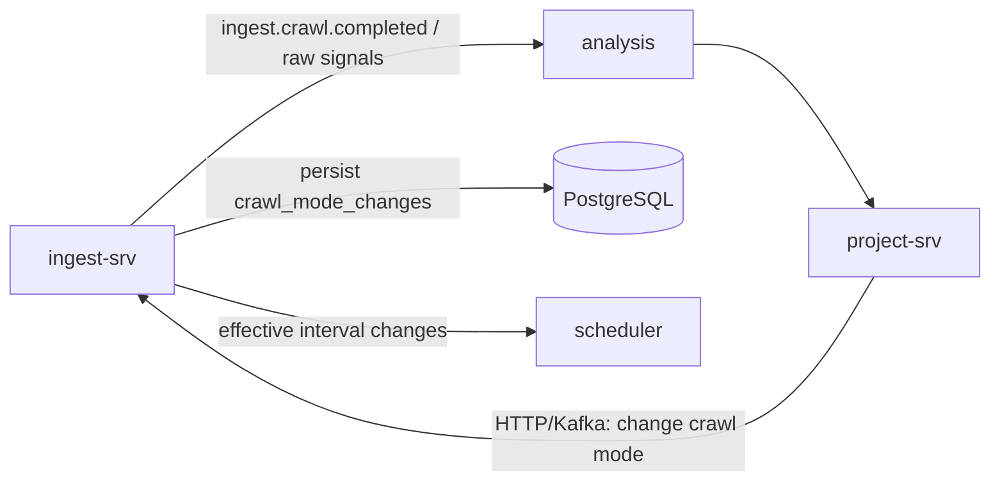
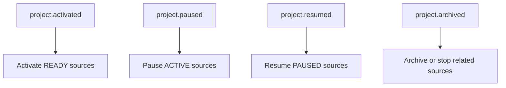

# ingest-srv

SMAP Ingest Service.

Service này chịu trách nhiệm quản lý `data source`, điều phối vòng đời ingest, tích hợp crawler bên thứ ba, lưu vết raw data, chuẩn hóa dữ liệu sang UAP và publish sang pipeline phân tích.

## Mục lục

- Tổng quan
- Service này làm gì
- Service này không sở hữu gì
- Liên kết với service khác
- Kiến trúc nội bộ
- Entity chính
- Business rules
- State machine
- Các flow chính
- API namespace và contract
- Trạng thái hiện tại
- Run và config

## Tổng quan

`ingest-srv` là service đứng giữa lớp quản lý nguồn dữ liệu và lớp xử lý dữ liệu đầu vào cho phân tích.

Nó làm 4 việc lớn:

1. quản lý metadata và lifecycle của source
2. điều phối crawl / upload / webhook intake
3. lưu trace lineage từ source -> target -> job -> task -> raw batch
4. chuẩn hóa raw thành UAP để hệ downstream consume

## Service này làm gì

### 1. Quản lý nguồn dữ liệu

- tạo và quản lý `data_sources`
- quản lý `crawl_targets` cho source crawl
- lưu `mapping_rules` cho source passive
- quản lý `crawl_mode`
- quản lý trạng thái `PENDING/READY/ACTIVE/PAUSED/FAILED/COMPLETED/ARCHIVED`

### 2. Điều phối lifecycle ingest

- dry run source trước khi chạy thật
- chuẩn hóa state transition của source
- phản ứng với lệnh activate/pause/resume/archive từ orchestration hoặc `project-srv`
- ghi audit trail khi đổi crawl mode

### 3. Tích hợp runtime với crawler bên ngoài

- publish task sang crawler qua RabbitMQ
- consume kết quả crawl
- tạo `external_tasks` và `raw_batches`
- đảm bảo idempotency theo `task_id` và lineage theo source/target

### 4. Chuẩn hóa và publish dữ liệu

- parse raw payload/file theo loại source
- áp `mapping_rules`
- chuẩn hóa record thành UAP
- publish sang topic phân tích

## Service này không sở hữu gì

`ingest-srv` không sở hữu:

- `projects`
- `campaigns`
- `project_crisis_config`
- `crisis_alerts`
- business decision cuối cùng về activate project hay crisis policy

Các phần đó thuộc `project-srv`.

## Liên kết với service khác

## System Context



## Bảng tương tác liên service

| Service / System | Quan hệ với `ingest-srv` | Giao thức | Mục đích |
|---|---|---|---|
| `project-srv` | orchestration + ownership business | HTTP, Kafka | đổi crawl mode, activate/pause/resume theo lifecycle project |
| `scapper-srv` | crawler runtime | RabbitMQ | nhận crawl task, trả crawl result/raw reference |
| Analysis pipeline | downstream consumer | Kafka | nhận UAP chuẩn hóa từ ingest |
| MinIO | object storage | S3-compatible API | lưu raw file/payload và asset trung gian |
| PostgreSQL | persistence chính | SQL | lưu source, target, dryrun, task, batch, audit |
| Redis | infra phụ trợ | Redis protocol | cache/lock/coordination nếu cần |

## `project-srv` tương tác với `ingest-srv` như thế nào

### Ownership boundary

| Concern | Owner |
|---|---|
| `project`, `campaign`, crisis config | `project-srv` |
| `data_source`, `crawl_target`, `dryrun`, `scheduled_job`, `external_task`, `raw_batch` | `ingest-srv` |

### Contract chính

| Direction | Contract | Ý nghĩa |
|---|---|---|
| `project-srv -> ingest-srv` | `PUT /ingest/datasources/{id}/crawl-mode` | đổi mode crawl |
| `project-srv -> ingest-srv` | Kafka `project.activated` | activate source đang `READY` |
| `project-srv -> ingest-srv` | Kafka `project.paused` | pause source đang `ACTIVE` |
| `project-srv -> ingest-srv` | Kafka `project.resumed` | resume source đang `PAUSED` |
| `project-srv -> ingest-srv` | Kafka `project.archived` | archive hoặc dừng flow source liên quan |
| `ingest-srv -> project-srv` | Kafka `ingest.source.*` | phản hồi state lifecycle của source |
| `ingest-srv -> project-srv` | Kafka `ingest.dryrun.completed` | báo dry run hoàn tất |
| `ingest-srv -> project-srv` | Kafka `ingest.crawl.completed` | báo batch crawl hoàn tất |

## `scapper-srv` tương tác với `ingest-srv` như thế nào



### Contract cần giữ

- contract RabbitMQ canonical nằm ở `../scapper-srv/RABBITMQ.md`
- `task_id` là correlation key chính
- duplicate response theo cùng `task_id` phải xử lý idempotent

## Analysis pipeline tương tác với `ingest-srv` như thế nào

- ingest publish dữ liệu đầu vào phân tích sau khi parse + normalize
- topic canonical là `smap.collector.output`
- mỗi UAP message tương ứng 1 đơn vị phân tích: `post` hoặc `comment` hoặc `reply`

## Kiến trúc nội bộ



## Module nội bộ và trách nhiệm

| Module | Trách nhiệm |
|---|---|
| `internal/datasource` | CRUD source + target, lifecycle control plane, crawl mode |
| `internal/dryrun` | dry run source/target, readiness transition, history |
| `internal/crawler` | publish/consume RabbitMQ với crawler bên ngoài |
| `internal/parser` | raw -> mapping -> UAP -> Kafka |
| `internal/scheduler` | tick scheduler và tạo job/task runtime |
| `internal/projectsync` | consume lifecycle events từ `project-srv` |
| `internal/httpserver` | mount router, middleware, health endpoints |
| `internal/consumer` | consumer infrastructure |
| `internal/model` | domain model + enum dùng chung |
| `internal/sqlboiler` | generated DB models/queries |

## Entity chính

| Entity | Vai trò |
|---|---|
| `data_sources` | source of truth cho metadata và lifecycle của nguồn dữ liệu |
| `crawl_targets` | đơn vị scheduling chính của source `CRAWL` |
| `dryrun_results` | lưu kết quả dry run và readiness evidence |
| `scheduled_jobs` | record điều phối lịch crawl |
| `external_tasks` | record task đã gửi sang hệ ngoài / crawler |
| `raw_batches` | batch raw đã nhận/lưu để parse/publish |
| `crawl_mode_changes` | audit trail cho các lần đổi mode |

## Business rules

## 1. Ownership và boundary rules

| Rule | Mô tả |
|---|---|
| `project_id` là logical FK | không dùng DB foreign key cross-service |
| `ingest-srv` là source of truth của source metadata | project không ghi trực tiếp vào bảng ingest |
| namespace chuẩn là `datasources` | không dùng `/sources` cho contract mới |

## 2. Rules cho `data_source`

| Rule | Mô tả |
|---|---|
| source mới luôn ở `PENDING` | chưa được chạy thật ngay sau create |
| `COMPLETED` chỉ dành cho one-shot source | chủ yếu là `FILE_UPLOAD` |
| `CRAWL` source cần `crawl_mode` và `crawl_interval_minutes > 0` | để có thể chạy runtime |
| `source_category` có thể infer từ `source_type` | `CRAWL` cho social crawl, `PASSIVE` cho file/webhook |
| source `ACTIVE` không được sửa `config` và `mapping_rules` | tránh phá runtime đang chạy |
| đổi `config` crawl phải reset dry run state | clear `dryrun_last_result_id`, đưa source về trạng thái cần validate lại |

## 3. Rules cho `crawl_target`

| Rule | Mô tả |
|---|---|
| target chỉ được tạo dưới source `CRAWL` | không tạo target cho `FILE_UPLOAD/WEBHOOK` |
| `target_type` hợp lệ là `KEYWORD`, `PROFILE`, `POST_URL` | enum canonical |
| interval của target nếu không truyền sẽ kế thừa từ datasource | default inheritance |
| ownership phải kiểm theo `(data_source_id, target_id)` | không được thao tác target chéo datasource |
| `crawl_targets` là đơn vị scheduling chính | không schedule theo datasource tổng quát |

## 4. Rules cho lifecycle source

| Rule | Mô tả |
|---|---|
| `READY` là cổng vào của `ACTIVE` | không activate trực tiếp từ `PENDING` |
| user không tự activate source qua public API trong V1 | activate chủ yếu do `project-srv` orchestration |
| `ACTIVE -> PAUSED -> ACTIVE` là vòng đời crawl bình thường | dùng cho pause/resume |
| `ARCHIVED` là trạng thái kết thúc | giữ lịch sử, ngừng vận hành |

## 5. Rules cho dry run

| Rule | Mô tả |
|---|---|
| dry run chỉ chạy khi source ở `PENDING` hoặc `READY` | không chạy tự do ở mọi state |
| `SUCCESS` -> source sang `READY` | đủ điều kiện chờ activate |
| `WARNING` -> source vẫn `READY` | có cảnh báo nhưng usable |
| `FAILED` -> source chưa được chạy thật | thường giữ `PENDING` hoặc cần sửa config |
| dry run của `CRAWL` là per-target | trace bằng `dryrun_results.target_id` |
| dry run của `PASSIVE` không cần `target_id` | áp cho file upload / webhook |

## 6. Rules cho crawl mode

| Rule | Mô tả |
|---|---|
| mode hợp lệ là `SLEEP`, `NORMAL`, `CRISIS` | enum canonical |
| mode chỉ áp dụng cho source `CRAWL` | source passive không nhận crawl mode |
| đổi mode phải ghi `crawl_mode_changes` | audit trail bắt buộc |
| effective interval = `target_interval x mode_multiplier` | dùng ở scheduler runtime |

### Mode multiplier

| Mode | Multiplier | Ý nghĩa |
|---|---:|---|
| `CRISIS` | `0.2` | crawl dày hơn |
| `NORMAL` | `1.0` | mặc định |
| `SLEEP` | `5.0` | crawl thưa hơn |

## 7. Rules cho parser và publish

| Rule | Mô tả |
|---|---|
| 1 UAP message = 1 đơn vị phân tích | post/comment/reply |
| luôn giữ `raw.original_fields` + `trace.raw_ref` | phục vụ audit/reprocess |
| parse lifecycle và publish lifecycle tách riêng | `batch_status` và `publish_status` không trộn |
| V1 publish fail -> fail toàn batch | không hỗ trợ partial success |
| không dùng `ingest.data.first_batch` làm contract mới | event canonical là `ingest.crawl.completed` |

## 8. Rules về idempotency và replay

| Concern | Rule |
|---|---|
| RabbitMQ request/response | idempotency theo `task_id` |
| raw batch dedup | theo `(source_id, batch_id)`, fallback `checksum` |
| replay | mặc định chỉ cho batch lỗi; batch `SUCCESS` cần `force = true` + audit |

## State machine

## Data Source Lifecycle



## Dryrun Lifecycle



## Crawl Runtime Lineage



## Các flow chính

## 1. User onboarding flow



## 2. Crawl runtime flow

```mermaid
sequenceDiagram
    participant SCH as Scheduler
    participant DS as DataSource/CrawlTarget
    participant ING as Ingest Runtime
    participant MQ as RabbitMQ
    participant SCP as scapper-srv
    participant MIN as MinIO
    participant PAR as Parser
    participant ANA as Analysis

    SCH->>DS: query target đến hạn
    SCH->>ING: create scheduled_job
    ING->>ING: create external_task
    ING->>MQ: publish task
    MQ->>SCP: deliver task
    SCP->>MIN: upload raw
    SCP->>MQ: publish response
    MQ->>ING: consume response
    ING->>ING: create raw_batch
    ING->>PAR: trigger parse pipeline
    PAR->>ANA: publish UAP
```

## 3. Crisis feedback loop



## 4. Project lifecycle sync



## API namespace và contract

## Canonical namespace

| Deprecated | Canonical |
|---|---|
| `/sources/*` | `/datasources/*` |
| `PUT /ingest/sources/{id}/crawl-mode` | `PUT /ingest/datasources/{id}/crawl-mode` |
| `ingest.data.first_batch` | `ingest.crawl.completed` |

## Nhóm endpoint chính

### User-facing

| Method | Path | Mục đích |
|---|---|---|
| `POST` | `/api/v1/datasources` | tạo source |
| `GET` | `/api/v1/datasources` | list source |
| `GET` | `/api/v1/datasources/:id` | detail source |
| `PUT` | `/api/v1/datasources/:id` | update source |
| `DELETE` | `/api/v1/datasources/:id` | archive source |
| `POST` | `/api/v1/datasources/:id/targets` | create target |
| `GET` | `/api/v1/datasources/:id/targets` | list targets |
| `GET` | `/api/v1/datasources/:id/targets/:target_id` | detail target |
| `PUT` | `/api/v1/datasources/:id/targets/:target_id` | update target |
| `DELETE` | `/api/v1/datasources/:id/targets/:target_id` | delete target |

### Internal / orchestration-facing

| Method | Path | Mục đích |
|---|---|---|
| `GET` | `/health` | health check |
| `GET` | `/ready` | readiness check |
| `GET` | `/live` | liveness check |
| `GET` | `/api/v1/ingest/ping` | ingest ping |
| `PUT` | `/api/v1/ingest/datasources/:id/crawl-mode` | đổi crawl mode |
| `POST` | `/api/v1/internal/datasources/:id/trigger` | manual trigger task |
| `POST` | `/api/v1/internal/raw-batches/:id/replay` | replay parse/publish |

## Trạng thái hiện tại

## Snapshot implementation

| Hạng mục | Trạng thái khái quát |
|---|---|
| datasource CRUD public | đã có nền tảng |
| crawl_target CRUD public | đã có nền tảng |
| delivery validation phase 1 | đã được siết thêm |
| lifecycle API phase 2 | đang triển khai |
| dry run module | chưa hoàn chỉnh |
| scheduler per-target runtime | chưa hoàn chỉnh |
| RabbitMQ end-to-end runtime | chưa hoàn chỉnh |
| parser -> UAP -> Kafka end-to-end | chưa hoàn chỉnh |

## Thứ tự đọc tài liệu khuyến nghị

1. `README.md`
2. `documents/plan/ingest_next_phase_plan.md`
3. `documents/plan/ingest_phase2_lifecycle_plan.md`
4. `documents/resource/ingest/ingest_plan.md`
5. `documents/resource/ingest/ingest_project_schema_alignment_proposal.md`

## Run và config

## Run

```bash
make run-api
make run-consumer
make run-scheduler
```

## Config

- `config/ingest-config.yaml`
- `config/ingest-config.example.yaml`

## Ghi chú cuối

README này nhằm giúp người đọc:

- nắm tổng quan service trong 5-10 phút
- hiểu boundary với `project-srv`, `scapper-srv`, analysis
- thấy ngay các rule quan trọng và state machine
- biết service hiện đang ở đâu trong roadmap
