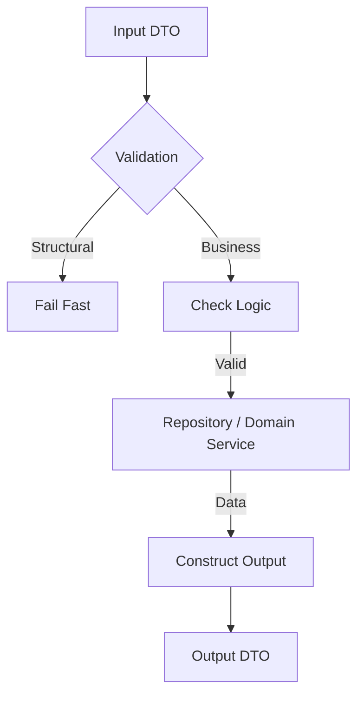
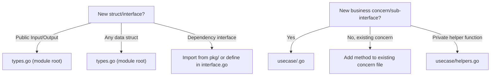

# UseCase Layer Convention (`convention_usecase.md`)

> **Role**: The UseCase Layer is the **Brain**. It houses all Business Logic.
> **Motto**: "Pure Go. No Frameworks. Strict Typing."

## 1. The Logic Flow



---

## 2. Core Principles

1.  **Framework Agnostic**: This layer **MUST NOT** import `gin`, `sqlboiler`, `mongo-driver`, or `amqp`. It only knows about _Interfaces_ and _Standard Library_.
2.  **Interface Driven**: Dependencies are injected.
3.  **Strict Inputs/Outputs**: Every public method uses a dedicated struct in `types.go`.
4.  **One File, One Concern**: Logic files contain ONLY logic. Data struct definitions live in module root `types.go`.
5.  **No Magic Event Names**: Event names **MUST** be typed constants (enum style) in module `types.go`, never hardcoded strings inside usecase methods.
6.  **Microservice Dependency Rule**: Usecase must depend on interfaces in `pkg/microservice` root package, not concrete service packages.
7.  **Downstream Error Mapping Rule**: Mapping from downstream client errors to module domain errors belongs to module `errors.go` (root), then usecase reuses that mapper.
8.  **No Wire Tags in UseCase Types**: `json/form/binding` tags are only allowed in delivery DTOs.
9.  **Constant Placement Rule**:
   - Entity intrinsic constants (state/attributes shared system-wide) go to `internal/model`.
   - Module-level/process constants go to module root `types.go`.
   - Usecase implementation files must not define `const`.
10. **Helper Receiver Rule**:
   - Private helpers in `helpers.go` must be methods with receiver `func (uc *implUseCase) ...`.
11. **No Delivery Import Rule**:
   - Usecase must not import `internal/<module>/delivery/...`.
   - Delivery is responsible for mapping transport payloads to module/usecase types before calling usecase.

---

## 2.1 File Structure & Splitting Rules

The UseCase layer follows the **File Responsibility Principle**: every file has exactly one job.

### Module Root Files

| File           | Contents                                                              |
| -------------- | --------------------------------------------------------------------- |
| `interface.go` | `UseCase` interface definition                                        |
| `types.go`     | ALL public Input/Output structs (e.g., `CreateInput`, `DetailOutput`) |
| `errors.go`    | Module-specific sentinel errors (e.g., `ErrUserNotFound`)             |

### Implementation Files (`usecase/`)

| File          | Contents                                                                                                               |
| ------------- | ---------------------------------------------------------------------------------------------------------------------- |
| `new.go`      | **Factory ONLY**: `implUseCase` struct + `New()` + optional setter methods. **No interfaces, no extra helper types, no constants.** |
| `<concern>.go` | Group method implementations by **sub-interface / business concern** (e.g., `usecase.go`, `consumer.go`, `cron.go`, `dryrun.go`, `target.go`) |
| `helpers.go`  | ALL private helper methods (validation, formatting, parsing, etc.) used by public methods                              |

**File Naming Rules:**

- ✅ Name files by concern/sub-interface: `usecase.go`, `consumer.go`, `cron.go`, `publisher.go`, `target.go`, `project_lifecycle.go`, `dryrun.go`
- ✅ If module `UseCase` embeds 3 sub-interfaces, aim for 3 corresponding implementation files (excluding `new.go`, `helpers.go`, tests)
- ❌ Do not split into one file per method by default
- ❌ NEVER create separate files for helpers (e.g., `validation.go`, `embedding.go`, `qdrant.go`) → ALL go to `helpers.go`

**Example: Bad vs Good Structure**

❌ **BAD** (Too fragmented by method):

```text
usecase/
├── new.go
├── create.go
├── detail.go
├── list.go
├── update.go
├── pause.go
├── resume.go
├── activate.go
└── helpers.go
```

✅ **GOOD** (Grouped by concern/sub-interface):

```text
usecase/
├── new.go                 ← Factory
├── usecase.go             ← Main usecase concern (CRUD / primary flow)
├── project_lifecycle.go   ← Project orchestration concern
├── target.go              ← Target concern
├── dryrun.go              ← Dry-run concern
└── helpers.go             ← ALL private helpers
```

### Example: Complex Module

```text
internal/authentication/
├── interface.go            # UseCase interface
├── types.go                # OAuthCallbackInput, TokenValidationResult, etc.
├── errors.go               # ErrUserNotFound, ErrDomainNotAllowed, etc.
└── usecase/
    ├── new.go              # implUsecase struct + New() + setters (50 lines)
    ├── get_current_user.go # GetCurrentUser() + validateSession (80 lines)
    ├── logout.go           # Logout() + cleanupSession (60 lines)
    ├── validate_token.go   # ValidateToken() + parseToken + checkExpiry (120 lines)
    └── process_oauth_callback.go  # ProcessOAuthCallback() + createSession + validateDomain + generateToken (200 lines)
```

**Note:** `helpers.go` is shared across concern files; private helpers should not be scattered.

### Splitting Decision Tree



---

## 3. Implementation Details

### 3.1 Business vs. Structural Validation

Distinguish these two.

- **Structural (Delivery Layer)**: Simple format checks.
  - _Eg: "Is email valid?", "Is Age > 0?"_ - **Do this in Delivery.**
- **Business (UseCase Layer)**: Logic that requires knowledge of the system state.
  - _Eg: "Does this user exist?", "Is the shop active?", "Does user have permission X?"_ - **Do this in UseCase.**

### 3.2 The `New` Factory (`new.go`)

`new.go` is **strictly a factory**. It contains ONLY:

- The `implUseCase` struct (private)
- The `New()` constructor
- Optional setter methods for late-bound dependencies

> [!CAUTION]
> **NEVER** define interfaces, constants, extra helper/data types, or business logic in `new.go`. If you need a dependency interface, import it from `pkg/` or define it in the module's `interface.go`.

```go
// ✅ Correct: new.go contains ONLY struct + factory + setters
type implUseCase struct {
    repo   Repository
    l      pkgLog.Logger
    userUC user.UseCase
}

func New(repo Repository, l pkgLog.Logger, userUC user.UseCase) UseCase {
    return &implUseCase{
        repo:   repo,
        l:      l,
        userUC: userUC,
    }
}

func (u *implUseCase) SetAuditPublisher(p audit.Publisher) {
    u.auditPublisher = p
}
```

```go
// ❌ Wrong: defining interfaces inside new.go
type OAuthProvider interface { ... }  // Move to pkg/oauth or interface.go
type RateLimiter interface { ... }    // Move to pkg/ or separate file
```

### 3.3 Concurrency (Using `errgroup`)

Use `errgroup` for parallel processing. **NEVER** use naked `go func()` in UseCase without a wait mechanism (unless it's fire-and-forget, which should go to a Job/MQ).

```go
import "golang.org/x/sync/errgroup"

func (uc *implUseCase) Dashboard(ctx context.Context, id string) (DashboardOut, error) {
    g, ctx := errgroup.WithContext(ctx)
    var user models.User
    var stats models.Stats

    // 1. Fetch User
    g.Go(func() error {
        var err error
        user, err = uc.repo.GetUser(ctx, id)
        return err
    })

    // 2. Fetch Stats
    g.Go(func() error {
        var err error
        stats, err = uc.repo.GetStats(ctx, id)
        return err
    })

    // 3. Wait
    if err := g.Wait(); err != nil {
        uc.l.Errorf(ctx, "Dashboard failed: %v", err)
        return DashboardOut{}, err
    }

    return DashboardOut{User: user, Stats: stats}, nil
}
```

---

## 4. Anti-Patterns (The "Strictly Forbidden" List)

- ❌ **Forbidden Imports**:
  - `github.com/gin-gonic/gin` (This belongs in Delivery)
  - `github.com/volatiletech/sqlboiler` (This belongs in Repository)
- ❌ **Returning Models**:
  - Returning `models.User` directly exposes DB structure. Wrap it in `UserOutput`.
- ❌ **Silent Logs**:
  - `if err != nil { log.Error(err); return nil }` -> **WRONG**. Return the error!
- ❌ **Defining structs in usecase logic files**:
  - Keep struct type declarations in module root `types.go` (except `implUseCase` in `new.go` and test-only types in `_test.go`).
- ❌ **God files**:
  - A single `usecase.go` with 800+ lines handling multiple concerns. Split by entity/concern.
- ❌ **Defining interfaces in `new.go`**:
  - `new.go` is factory-only. Dependency interfaces belong in `pkg/` or `interface.go`.
- ❌ **Usecase depending on `pkg/microservice/<service>` contract types**:
  - Contract interface/types must come from `pkg/microservice` root package.
- ❌ **Placing downstream error mapping in arbitrary usecase files**:
  - Keep downstream-to-domain mapping centralized in module `errors.go`.
- ❌ **Magic strings for event names in usecase files**:
  - Event names must use typed constants from `types.go` (e.g., `LifecycleEventName`), not `"module.event.name"` literals.
- ❌ **Scattering helper functions across usecase files**:
  - Private helper methods must live in `helpers.go` (except truly method-local private closures).
- ❌ **Declaring constants in usecase implementation files**:
  - Put constants in module `types.go` or `internal/model` only.
- ❌ **Helpers without receiver**:
  - In `helpers.go`, use `func (uc *implUseCase) helper(...)`, not standalone `func helper(...)`.

---

## 5. Intern Checklist (Read before PR)

- [ ] **Import Check**: Did I import `gin` or `http`? **Remove it.**
- [ ] **Type Check**: Am I using `CreateInput` and `CreateOutput` structs from `types.go`?
- [ ] **Error Check**: Am I wrapping errors or using `errors.go` definitions?
- [ ] **Logic Check**: Is this logic re-usable? If I call this from a CLI or Job, will it work? (If it relies on HTTP headers, the answer is NO).
- [ ] **File Split Check**: Does my logic file contain any `type` declarations? **Move them to `types.go`.**
- [ ] **`new.go` Check**: Does `new.go` contain anything other than struct + factory + setters? **Move it out.**
