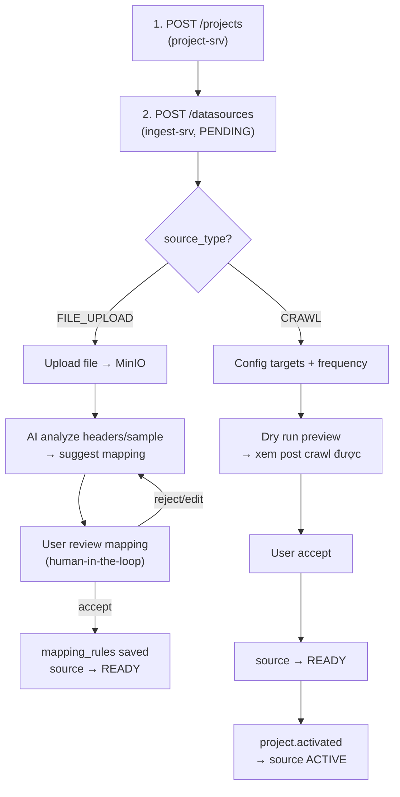

# Gap Analysis: Thiết kế hiện tại vs Yêu cầu thực tế

> **Trạng thái:** Đa số gap trong tài liệu này đã được absorb vào:
> - `documents/resource/ingest/ingest_project_schema_alignment_proposal.md` v1.4
> - `documents/resource/ingest/ingest_plan.md` v1.2
> - `documents/resource/ingest/adaptive_interval_and_idempotency_decisions.md`
>
> Tài liệu này hiện được giữ như bản phân tích lịch sử để giải thích vì sao thiết kế đã chuyển sang `crawl_targets`, per-target scheduling và `datasources` namespace.

## User Flow mong muốn



---

## 1. CRAWL Flow – Phân tích Gap

### Yêu cầu thực tế

User cần config **nhiều loại target cùng lúc** trên **1 datasource**, **mỗi target có tần suất crawl riêng**:

| Target Type | Ví dụ                      | Tần suất              | Hành vi                                    |
| ----------- | -------------------------- | --------------------- | ------------------------------------------ |
| `KEYWORD`   | "VinFast VF8", "xe điện"   | Mỗi 15p search lại    | Crawl liên tục, kết quả mới mỗi lần        |
| `PROFILE`   | @vinfast_official          | Mỗi 30p check profile | Crawl posts mới từ profile                 |
| `POST_URL`  | https://tiktok.com/.../123 | Mỗi 60p check lại     | Crawl comments/engagement mới trên post đó |

- Mỗi loại có thể có nhiều giá trị. User mix cả 3 loại trong 1 datasource.
- **Mỗi target có `crawl_interval_minutes` riêng** → scheduler tạo job per-target, không phải per-datasource.
- Ví dụ: keyword "VinFast" crawl 10p/lần, nhưng profile @vinfast crawl 30p/lần.

### Thiết kế trước khi điều chỉnh

Schema proposal section 8.1 đã list `keywords`, `links`, `profile_links` trong `config` JSON:

```json
{
  "keywords": ["VinFast VF8", "xe điện"],
  "links": ["https://tiktok.com/..."],
  "profile_links": ["@vinfast_official"],
  "max_results": 100,
  "comment_limit": 50
}
```

### Đánh giá

| Khía cạnh              | Status                | Ghi chú                                             |
| ---------------------- | --------------------- | --------------------------------------------------- |
| Chỗ lưu targets        | ✅ Đã có              | Đã chuyển sang bảng `crawl_targets`                 |
| Structure rõ ràng      | ✅ Đã có              | Có `target_type`, `value`, `platform_meta`          |
| CRUD từng target riêng | ✅ Đã có trong plan   | `POST/GET/PUT/DELETE /datasources/:id/targets`      |
| Dry run per target     | ✅ Đã có              | `dryrun_results.target_id`                          |
| Thống kê per target    | ⚠️ Chưa implement runtime | Schema/plan đã chừa chỗ, cần code thật         |

### Đề xuất: Tách bảng `crawl_targets`

```sql
CREATE TABLE schema_ingest.crawl_targets (
    id                     UUID PRIMARY KEY DEFAULT gen_random_uuid(),
    data_source_id         UUID NOT NULL REFERENCES data_sources(id),
    target_type            TEXT NOT NULL,              -- 'KEYWORD', 'PROFILE', 'POST_URL'
    value                  TEXT NOT NULL,              -- "VinFast VF8" hoặc URL
    label                  TEXT,                       -- Display label cho UI
    platform_meta          JSONB,                      -- Platform-specific: profile_id, hashtag_id...
    is_active              BOOLEAN DEFAULT true,       -- Tạm tắt target mà không xóa

    -- Per-target crawl schedule
    crawl_interval_minutes INT NOT NULL DEFAULT 11,    -- Tần suất crawl riêng cho target này
    next_crawl_at          TIMESTAMPTZ,                -- Scheduler pick target nào đến hạn
    last_crawl_at          TIMESTAMPTZ,                -- Lần crawl gần nhất
    last_success_at        TIMESTAMPTZ,                -- Lần thành công gần nhất
    last_error_at          TIMESTAMPTZ,                -- Lần lỗi gần nhất
    last_error_message     TEXT,                       -- Lỗi gần nhất per target

    created_at             TIMESTAMPTZ DEFAULT now(),
    updated_at             TIMESTAMPTZ DEFAULT now()
);

CREATE INDEX idx_crawl_targets_source ON schema_ingest.crawl_targets(data_source_id);
CREATE INDEX idx_crawl_targets_next   ON schema_ingest.crawl_targets(next_crawl_at)
    WHERE is_active = true;
```

**Thay đổi quan trọng so với thiết kế cũ:**

| Trước (per-datasource)                | Sau (per-target)                       |
| ------------------------------------- | -------------------------------------- |
| `data_sources.crawl_interval_minutes` | `crawl_targets.crawl_interval_minutes` |
| `data_sources.next_crawl_at`          | `crawl_targets.next_crawl_at`          |
| `data_sources.last_crawl_at`          | `crawl_targets.last_crawl_at`          |
| Scheduler tạo 1 job per datasource    | Scheduler tạo 1 job per target         |
| Dry run per datasource                | Dry run per target                     |

**`data_sources` vẫn giữ:** `crawl_mode` (SLEEP/NORMAL/CRISIS ảnh hưởng tất cả targets), `status`, `dryrun_status`. Các field `crawl_interval_minutes`, `next_crawl_at`, `last_crawl_at` trên `data_sources` có thể **deprecated** hoặc giữ làm summary/fallback.

**Lợi ích:**

- CRUD từng target riêng (thêm keyword không ảnh hưởng profile)
- Tần suất crawl khác nhau per target (keyword 10p, profile 30p, link 60p)
- Dry run chạy per-target → preview "keyword X tìm thấy 50 posts"
- External task gắn `target_id` → biết crawl cho target nào
- Scheduler query `next_crawl_at` per target thay vì per datasource

**`config` JSON vẫn giữ** nhưng chỉ chứa crawl options chung:

```json
{
  "max_results": 100,
  "comment_limit": 50,
  "include_replies": true,
  "timeout_seconds": 300,
  "batch_size": 50,
  "language_filter": ["vi", "en"]
}
```

---

## 2. FILE_UPLOAD Flow

> [!NOTE]
> **TODO — Tạm bỏ qua trong V1.** Schema đã sẵn sàng (`mapping_rules` JSON shape, `onboarding_status` enum). Khi implement cần thêm:
>
> - `POST /datasources/file-upload` — upload file → MinIO → tạo source FILE_UPLOAD
> - `POST /datasources/:id/mapping/preview` — gọi AI phân tích sample → suggest mapping
> - `PUT /datasources/:id/mapping` — user accept/edit → cập nhật `mapping_rules`
> - Tích hợp AI API cho schema detection + mapping suggestion

---

## 3. Tổng kết Gap

### ✅ Đã được chốt trong tài liệu mới

| #   | Gap                            | Ảnh hưởng                                     | Đề xuất                                             |
| --- | ------------------------------ | --------------------------------------------- | --------------------------------------------------- |
| 1   | **Bảng `crawl_targets`**       | Đã thêm vào schema proposal v1.4              | Runtime chưa implement                              |
| 2   | **CRUD endpoints cho targets** | Đã thêm vào implementation plan v1.2          | `POST/GET/PUT/DELETE /datasources/:id/targets`      |
| 3   | **Scheduler per-target**       | Đã chốt trong proposal + plan                 | Cần migrate từ scheduler per-datasource cũ          |
| 4   | **Dry run per-target**         | Đã chốt `dryrun_results.target_id`            | Cần implement execution flow                        |

### ✅ Đã đủ (không cần sửa)

| #   | Feature                                 | Where                                                       |
| --- | --------------------------------------- | ----------------------------------------------------------- |
| 1   | Source lifecycle (PENDING→READY→ACTIVE) | `source_status` enum + repo                                 |
| 2   | Crawl mode (SLEEP/NORMAL/CRISIS)        | `data_sources.crawl_mode` — ảnh hưởng global                |
| 3   | Dry run result storage                  | `dryrun_results` table                                      |
| 4   | Mapping rules JSON shape                | Section 8.4, sẵn sàng cho FILE_UPLOAD                       |
| 5   | Onboarding status tracking              | `onboarding_status` enum (6 states)                         |
| 6   | Webhook config                          | `webhook_id` + `webhook_secret_encrypted`                   |
| 7   | Scheduler + external tasks              | `scheduled_jobs` + `external_tasks` — đã chốt per-target, còn chờ runtime code |
| 8   | Raw batch tracking                      | `raw_batches` table                                         |

### ⚠️ Còn cần theo dõi khi implement

| #   | Item                                           | Điều chỉnh                                                       |
| --- | ---------------------------------------------- | ---------------------------------------------------------------- |
| 1   | `config` JSON                                  | Đã chốt chỉ giữ crawl options chung                              |
| 2   | `account_ref`                                  | Đã deprecated trong proposal v1.4                                |
| 3   | `data_sources.crawl_interval_minutes`          | Đã chốt là default cho target mới                                |
| 4   | `data_sources.next_crawl_at` / `last_crawl_at` | Đã chốt deprecated, giữ làm summary/fallback                     |
| 5   | `external_tasks`                               | Đã thêm `target_id` trong proposal                               |
| 6   | `dryrun_results`                               | Đã thêm `target_id` trong proposal                               |

---

## 4. Quyết định đã chốt

> [!IMPORTANT]
> **Q1 đã chốt:** Tách bảng `crawl_targets` với per-target frequency.

> [!IMPORTANT]
> **Q2 đã chốt:** `data_sources.crawl_interval_minutes` được giữ làm default cho target mới.

> [!IMPORTANT]
> **Q3 đã chốt:** `crawl_mode` vẫn ở level datasource, ảnh hưởng tất cả targets.

> [!IMPORTANT]
> **Q4 đã chốt:** Runtime policy dùng `mode_multiplier`, không dùng `absolute mode interval` làm policy chính.
