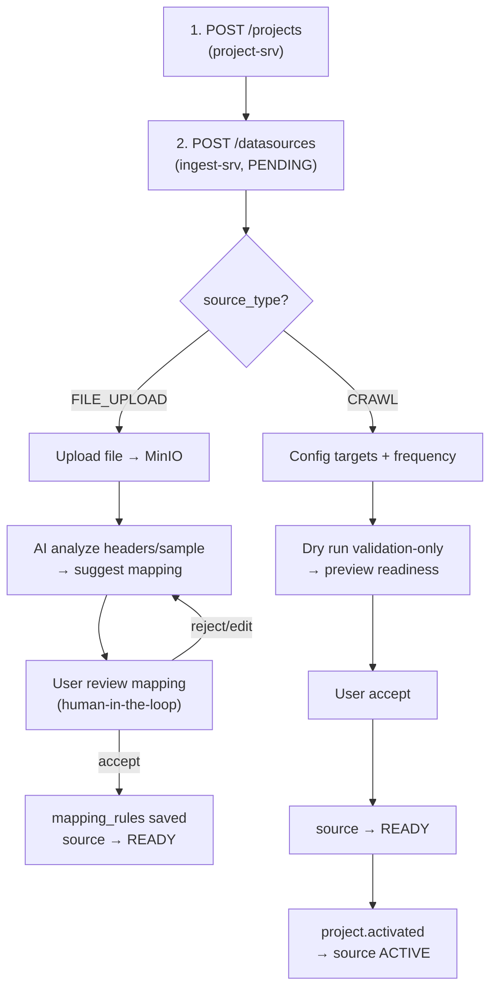

# INGEST SERVICE - QUICK NOTES

**Phiên bản:** 1.4  
**Ngày cập nhật:** 06/03/2026

## Document Status

- **Status:** Derived
- **Canonical reference:** `/mnt/f/SMAP_v2/cross-service-docs/proposal_chuan_hoa_docs_3_service_v1.md`
- **RabbitMQ canonical:** `/mnt/f/SMAP_v2/scapper-srv/RABBITMQ.md`

## Implementation Status Snapshot

| Hạng mục | Trạng thái |
|---|---|
| Data source + dryrun + internal crawl-mode runtime routes | Implemented |
| Scheduler per-target với `crawl_targets` | Planned |
| Kafka project lifecycle consume/publish nghiệp vụ | Planned |
| Scapper task APIs (`/api/v1/tasks/...`) | Implemented ở `scapper-srv` |

## Deprecation Mapping

| Deprecated | Canonical |
|---|---|
| `/sources/*` | `/datasources/*` |
| `PUT /ingest/sources/{id}/crawl-mode` | `PUT /ingest/datasources/{id}/crawl-mode` |
| `ingest.data.first_batch` | `ingest.crawl.completed` |

## User Flow mong muốn

## 1) Input mà Analysis đang cần

Analysis đang consume JSON theo **UAP v1.0** (topic docs hiện tại: `smap.collector.output`), gồm:

- root: `uap_version`, `event_id`
- `ingest`: `project_id`, `entity`, `source`, `batch`, `trace`
- `content`: `doc_id`, `doc_type`, `published_at`, `author`, `text`, `parent`, `attachments`
- `signals`: `engagement` (like/comment/share/view/rating), `geo`
- `context`: `keywords_matched`, `campaign_id`
- `raw`: `original_fields`

## 2) So sánh với raw TikTok (`tiktok_da_lat_20260224_145251.json`)

Raw hiện tại:
- Có dạng **batch**: 1 file chứa nhiều `posts[]`, mỗi post có `detail`, `comments[]`, `reply_comments[]`.
- Có dữ liệu tốt cho NLP: `description`, `comments.content`, `reply_comments.content`.
- Có metrics tốt: `likes_count`, `comments_count`, `shares_count`, `views_count`, `bookmarks_count`.
- Có metadata tác giả: `uid`, `username`, `nickname`, `avatar`.

Kết luận nhanh:
- **Đủ cho phân tích cơ bản** (sentiment/keyword/risk) sau khi tách record.
- **Chưa đủ để đẩy thẳng qua Analysis** nếu không map sang UAP:
  - thiếu block `ingest.*` chuẩn (`project_id`, `source_id`, `batch_id`, `mode`, `trace.raw_ref`...)
  - thiếu chuẩn hóa `doc_id/doc_type/parent` cho post-comment-reply
  - thiếu `context` theo project/campaign

## 3) Raw fields quan trọng nên tận dụng thêm để cải thiện analytics

- `hashtags` -> enrich keyword/context.
- `bookmarks_count` -> bổ sung engagement (`save_count`) để tính impact/risk tốt hơn.
- `reply_count`, `reply_comments` -> độ sâu tranh luận, phát hiện khủng hoảng sớm.
- `music_title`, `duration`, `is_shop_video` -> feature segment nội dung.
- `subtitle_url` + `summary` (nếu có) -> bổ sung text cho model.
- `video_resources`/`downloads` -> provenance + media intelligence (OCR/ASR pipeline sau này).

## 4) Ingest service cần làm gì (tổng hợp)

### API layer (user-facing)
- CRUD `datasource` (crawl + file upload + webhook).
- User config grouped crawl targets cho từng `datasource`:
  - `POST /datasources/:id/targets/keywords`
  - `POST /datasources/:id/targets/profiles`
  - `POST /datasources/:id/targets/posts`
- Mỗi `crawl_target` hiện chứa `values[]` dùng chung 1 `crawl_interval_minutes`.
- Nhận file upload (excel/json/csv/...) + lưu MinIO.
- Trigger/confirm mapping để clean về 1 chuẩn duy nhất (UAP).

### Producer/Consumer integration
- Producer qua RabbitMQ cho bên thứ 3 crawler (`tiktok_tasks`, sau này youtube/facebook).
- Consumer kết quả từ bên thứ 3 -> clean/normalize -> lưu raw vào MinIO.
- Publish UAP qua Kafka cho Analysis.
- Consumer command/event từ Project để đồng bộ vòng đời source và adaptive crawl
  (project activate/pause/resume + lệnh đổi crawl mode khi crisis).

Ghi chú contract:
- File **canonical** để chốt contract giao tiếp crawler là `/mnt/f/SMAP_v2/scapper-srv/RABBITMQ.md`.
- `documents/resource/ingest-intergrate-3rdparty/RABBITMQ.md` là bản mirror (derived) phục vụ team ingest theo dõi.

### Scheduler
- Scheduler chạy theo **per-target-group**, không còn per-datasource.
- Mỗi `crawl_target` có `values[]` và 1 `crawl_interval_minutes` chung cho cả group.
- Mỗi lần tick:
  - query `crawl_targets.next_crawl_at`
  - tính `effective_interval = target_interval x mode_multiplier(source.crawl_mode)`
  - pub task qua RabbitMQ
  - cập nhật `crawl_targets.next_crawl_at`, `last_crawl_at`
- `data_sources.crawl_interval_minutes` hiện không còn là implicit fallback ở public grouped-target create API; client phải gửi interval rõ cho target group.
- Dry run cho crawl hiện chạy theo **per-target-group** và là validation-only; pass sẽ trả `WARNING` rồi đưa source vào `READY`.

### Crisis feedback loop
- Flow: Ingest -> Analysis -> Project (detect crisis) -> Ingest (crawl nhanh hơn).
- Ingest phải nhận lệnh chuyển mode `NORMAL/SLEEP/CRISIS`; hiện tại phase 2 mới persist mode + audit, còn scheduler apply runtime nằm ở phase sau.

### Future capability
- AI-assisted schema mapping cho file upload đa định dạng:
  - đọc header/sample
  - gợi ý map field người dùng -> UAP
  - user review/confirm
  - tái sử dụng mapping cho các file sau.

## 5) Rule chốt để triển khai

- 1 UAP message = 1 đơn vị phân tích (`post` hoặc `comment` hoặc `reply`).
- Luôn giữ `raw.original_fields` + `trace.raw_ref` để audit/reprocess.
- Chốt 1 topic tên thống nhất cho input Analysis (tránh lệch `smap.collector.output` vs `analytics.uap.received`).
- Endpoint namespace chuẩn dùng `datasources`.
- `crawl_targets` là đơn vị scheduling chính cho crawl flow, nhưng mỗi record giờ là 1 **grouped target**.
- `dryrun_results.target_id` dùng để trace đúng grouped target trong dry run flow; `external_tasks.target_id` là contract runtime tương lai khi phase scheduler/crawler được hiện thực.
- Public create contract hiện yêu cầu interval ngay trên grouped target, không còn precedence fallback ở boundary API.
- Idempotency bắt buộc:
  - RabbitMQ theo `task_id`
  - Raw batch theo `(source_id, batch_id)` (fallback `checksum`)
  - Replay mặc định chỉ cho batch lỗi, batch `SUCCESS` cần `force = true` + audit.
