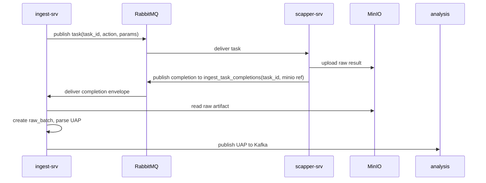

# Shared Runtime Contract Proposal: `scapper-srv <-> ingest-srv`

**Status:** Canonical shared runtime contract  
**Date:** 2026-03-08  
**Audience:** ingest, scapper, operations

## 0. Document Ownership

This document is the source of truth for:

- runtime boundary between `ingest-srv` and `scapper-srv`
- MinIO raw artifact contract
- idempotency and recovery rules
- `POST_URL` logical-run orchestration
- operational trace fields

This document does **not** redefine per-action payload shape. That stays canonical in:

- `/mnt/f/SMAP_v2/scapper-srv/RABBITMQ.md`

Repo-local proposal docs may explain service-specific implications, but they should link back here instead of redefining the wire contract.

## 1. Purpose

Define one cross-service production contract for:

- outbound RabbitMQ task dispatch
- inbound RabbitMQ completion envelope
- MinIO raw artifact storage
- idempotency and recovery rules
- `POST_URL` logical run orchestration

This document is the shared reference. Repo-local docs should link here instead of drifting.

## 2. Runtime Flow



## 3. RabbitMQ Task Request Envelope

```json
{
  "task_id": "uuid-v4",
  "action": "string",
  "params": {},
  "created_at": "2026-03-07T00:00:00Z"
}
```

Rules:

- `task_id` is generated by `ingest-srv`
- one publish attempt uses one unique `task_id`
- `params` must match platform/action contract in crawler docs
- request publish uses:
  - default exchange
  - routing key = platform queue name
  - durable queue + persistent message

## 4. RabbitMQ Completion Envelope

Completion publish uses:

- queue: `ingest_task_completions`
- routing key: `ingest_task_completions`
- default exchange
- durable queue + persistent message

```json
{
  "task_id": "uuid-v4",
  "queue": "tiktok_tasks|facebook_tasks|youtube_tasks",
  "platform": "tiktok|facebook|youtube",
  "action": "string",
  "status": "success|error",
  "completed_at": "2026-03-07T00:00:15Z",
  "storage_bucket": "ingest-raw",
  "storage_path": "crawl-raw/tiktok/search/2026/03/07/uuid.json",
  "batch_id": "raw-tiktok-search-uuid",
  "checksum": "sha256:...",
  "item_count": 2,
  "error": null,
  "metadata": {
    "crawler_version": "string",
    "duration_ms": 15234,
    "content_type": "application/json",
    "size_bytes": 1048576,
    "logical_run_id": "uuid-v4",
    "source_id": "optional echo",
    "target_id": "optional echo",
    "scheduled_job_id": "optional echo",
    "external_task_id": "optional echo"
  }
}
```

Rules:

- `task_id` is the message-level idempotency key
- `status=success` requires MinIO reference fields
- `status=error` may omit MinIO reference fields
- completion publish happens only after successful MinIO upload
- completion message must remain small; raw result does **not** travel in this envelope
- ingest resolves lineage (`project_id`, canonical source linkage, task ownership) by looking up `external_tasks.task_id`

## 5. MinIO Object Naming Convention

### 5.1 Raw artifact

`crawl-raw/{platform}/{action}/{yyyy}/{mm}/{dd}/{task_id}.json`

### 5.2 Parsed artifact

`uap-batches/{project_id}/{source_id}/{batch_id}.jsonl`

Rules:

- raw objects are immutable
- parsed artifacts are versioned or written once
- object metadata should carry `task_id`, `batch_id`, `platform`, `action`
- recommended raw `batch_id` format is `raw-{platform}-{action}-{task_id}`

## 6. Dedup and Idempotency

### 6.1 Message level

- key: `task_id`
- duplicate completion for same `task_id` must not create a second task result path

### 6.2 Raw batch level

- key: `(source_id, batch_id)`
- checksum is duplicate-detection fallback

### 6.3 Replay level

- replay reads from stored raw batch
- replay does not call crawler again
- replay does not create a new raw object

## 7. `POST_URL` Logical Run

One `POST_URL` logical run creates:

- task A: `post_detail`
- task B: `comments`

Shared lineage:

- `source_id`
- `target_id`
- `scheduled_job_id`
- `logical_run_id`

Independent execution units:

- `task_id`
- `external_task`
- raw object
- `raw_batch`

This model is the production default because crawler actions are already split.

## 8. Recovery Rules

### 8.1 Unknown task completion

- log and park/DLQ
- do not synthesize missing `external_task`

### 8.2 Missing object after success completion

- retry object fetch
- if still missing, mark failure/parking state

### 8.3 Upload success, publish retry

- republish completion with same `task_id` and MinIO reference
- ingest dedup keeps this safe

### 8.4 Orphan object detection

- scheduled reconciliation scans MinIO/object metadata vs persisted `external_tasks`
- orphan objects are logged and queued for manual review or automated repair

## 9. Operational Requirements

Required structured fields in logs and metrics:

- `task_id`
- `batch_id`
- `platform`
- `action`
- `source_id`
- `target_id`
- `scheduled_job_id`
- `external_task_id`
- `logical_run_id`

Recommended counters:

- tasks_dispatched
- tasks_completed_success
- tasks_completed_error
- completion_duplicates
- minio_upload_failures
- missing_object_after_completion
- raw_batches_created
- raw_batches_duplicate_dropped

## 10. Non-Canonical Debug Paths

The following remain allowed for dev/debug convenience but are not part of the production handoff contract:

- `scapper-srv/output/*.json`
- `GET /api/v1/tasks/{task_id}/result`
- `GET /api/v1/tasks`
