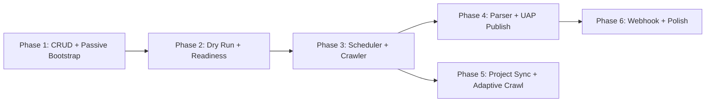

# Ingest Service – Implementation Plan

**Phiên bản:** 1.4  
**Ngày:** 06/03/2026  
**Tham chiếu chính:**

- [ingest_project_schema_alignment_proposal.md](./ingest_project_schema_alignment_proposal.md) (v1.6)
- [master_proposal.md](../../../../project-srv/documents/master_proposal.md) (v3.0)
- [cross-service master proposal](../../../../cross-service-docs/proposal_chuan_hoa_docs_3_service_v1.md)
- [canonical RabbitMQ](../../../../scapper-srv/RABBITMQ.md)

---

## Document Status

- **Status:** Derived
- **Canonical reference:** `/mnt/f/SMAP_v2/cross-service-docs/proposal_chuan_hoa_docs_3_service_v1.md`
- **Namespace chuẩn:** `datasources`

## Implementation Status Snapshot (docs vs runtime hiện tại)

| Hạng mục | Trạng thái |
|---|---|
| HTTP runtime mount cho datasource/dryrun/internal crawl-mode APIs | Implemented |
| Scheduler per-target dựa trên `crawl_targets` | Planned |
| Kafka lifecycle events end-to-end | Planned |
| DB hỗ trợ `crawl_targets` + `target_id` trace fields | Implemented |

## Deprecation Mapping

| Deprecated | Canonical |
|---|---|
| `/sources/*` | `/datasources/*` |
| `PUT /ingest/sources/{id}/crawl-mode` | `PUT /ingest/datasources/{id}/crawl-mode` |
| `ingest.data.first_batch` | `ingest.crawl.completed` |

---

## 1. Tổng quan Module

Ingest Service được chia thành **6 module nghiệp vụ** + **1 infrastructure layer**:

```
ingest-srv/
├── cmd/
│   ├── api/           ← HTTP server (user-facing + internal API)
│   ├── consumer/      ← Kafka + RabbitMQ consumer
│   └── scheduler/     ← Cron-based job scheduler
├── internal/
│   ├── datasource/    ← Module 1: Data Source Management
│   ├── dryrun/        ← Module 2: Dry Run & Onboarding
│   ├── crawler/       ← Module 3: Crawler Integration (RabbitMQ)
│   ├── parser/        ← Module 4: Raw → UAP Parser & Publisher
│   ├── scheduler/     ← Module 5: Job Scheduler
│   ├── projectsync/   ← Module 6: Project Event Sync
│   ├── httpserver/    ← Infrastructure: HTTP router/middleware
│   ├── consumer/      ← Infrastructure: Kafka/RabbitMQ consumer
│   ├── middleware/    ← Infrastructure: Auth middleware
│   ├── model/         ← Shared: Domain models + ENUMs
│   └── sqlboiler/     ← Shared: Generated DB access
```

---

## 2. Chi tiết từng Module

### Module 1: Data Source Management (`datasource`)

**Trách nhiệm:** CRUD data source, crawl targets management (keywords/profiles/post links), passive-source onboarding bootstrap, webhook bootstrap, crawl mode API.

| Layer      | File            | Nội dung                 |
| ---------- | --------------- | ------------------------ |
| Handler    | `handler.go`    | REST endpoints           |
| Presenter  | `presenter.go`  | Request/Response DTOs    |
| UseCase    | `usecase.go`    | Business logic           |
| Repository | `repository.go` | DB queries via sqlboiler |

**Endpoints:**

| Method   | Path                                 | Mô tả                                                |
| -------- | ------------------------------------ | ---------------------------------------------------- |
| `POST`   | `/datasources`                       | Tạo source mới (PENDING)                             |
| `GET`    | `/datasources`                       | List sources (filter by project_id, status, type)    |
| `GET`    | `/datasources/:id`                   | Chi tiết source                                      |
| `PUT`    | `/datasources/:id`                   | Update metadata/config theo state guard              |
| `POST`   | `/datasources/:id/archive`           | Archive source                                       |
| `DELETE` | `/datasources/:id`                   | Soft delete sau khi source đã `ARCHIVED`             |
| `POST`   | `/datasources/:id/targets/keywords`  | Tạo grouped keyword target với `values[]`            |
| `POST`   | `/datasources/:id/targets/profiles`  | Tạo grouped profile target với `values[]` URL        |
| `POST`   | `/datasources/:id/targets/posts`     | Tạo grouped post target với `values[]` URL           |
| `GET`    | `/datasources/:id/targets`           | List targets của source                              |
| `GET`    | `/datasources/:id/targets/:tid`      | Chi tiết grouped target                              |
| `PUT`    | `/datasources/:id/targets/:tid`      | Update grouped target (`values[]`, interval, state)  |
| `DELETE` | `/datasources/:id/targets/:tid`      | Xóa target                                           |
| `POST`   | `/datasources/file-upload`           | TODO: Upload file, lưu MinIO, tạo source FILE_UPLOAD |
| `POST`   | `/datasources/:id/mapping/preview`   | TODO: Phân tích sample và gợi ý mapping              |
| `PUT`    | `/datasources/:id/mapping`           | TODO: Confirm/update `mapping_rules`                 |
| `POST`   | `/datasources/:id/webhook/bootstrap` | Tạo `webhook_id` + secret cho source webhook         |
| `PUT`    | `/ingest/datasources/:id/crawl-mode` | **Internal API** - Project Service gọi để đổi mode   |
| `POST`   | `/internal/datasources/:id/trigger`  | **Internal API** - manual trigger tạo external task  |
| `POST`   | `/internal/raw-batches/:id/replay`   | **Internal API** - replay parse/publish batch        |

**Business Rules (from master_proposal):**

- Source tạo mới luôn ở `PENDING`.
- `COMPLETED` chỉ áp dụng cho `FILE_UPLOAD` (one-shot).
- `CRAWL` source được phép tạo ở `PENDING` khi chưa có target; nhưng để lên `READY`/`ACTIVE` bắt buộc phải có ít nhất 1 `crawl_target` active và `crawl_mode`.
- 1 `crawl_target` hiện là **1 grouped execution unit**:
  - `KEYWORD`: `values[]` là nhiều keyword dùng chung 1 interval
  - `PROFILE`: `values[]` là nhiều profile URL dùng chung 1 interval
  - `POST_URL`: `values[]` là nhiều post URL dùng chung 1 interval
- grouped target create hiện bắt buộc `crawl_interval_minutes > 0`; không còn implicit inheritance ở HTTP contract hiện tại.
- Effective interval = `target.crawl_interval_minutes × mode_multiplier(source.crawl_mode)`.
- Mode multiplier: `NORMAL = 1.0`, `CRISIS = 0.2`, `SLEEP = 5.0`.
- `crawl_mode_defaults` chỉ dùng làm default/fallback config (seed), không dùng để ghi đè interval runtime của target.
- `POST /datasources/:id/targets/keywords` sẽ trim + de-duplicate exact duplicate keywords trước khi persist.
- `POST /datasources/:id/targets/profiles` và `/posts` yêu cầu mọi phần tử trong `values[]` phải là URL hợp lệ.
- `PUT /datasources/:id/targets/:tid` thay `values[]` theo kiểu full replace nếu client gửi field này.
- `WEBHOOK` source ở `READY`/`ACTIVE` phải có `webhook_id` + `webhook_secret_encrypted`.
- Đổi `crawl_mode` phải ghi log vào `crawl_mode_changes`.
- `project_id` là logical FK — không validate qua DB, chỉ validate tồn tại khi cần (HTTP call tới project-srv).
- Không có public endpoint để user tự `activate` source trong V1. Source `ACTIVE` chủ yếu được kích hoạt bởi `project.activated` từ `project-srv`.
- `PUT /datasources/:id` chỉ cho phép sửa `name`, `description` mọi lúc; các field runtime-breaking như `config`, `source_type` chỉ cho sửa khi source chưa `ACTIVE`.
- Nếu thay đổi `config` crawl, phải reset `dryrun_status`, clear `dryrun_last_result_id`, và đưa source về trạng thái cần validate lại.
- `POST /datasources/:id/webhook/bootstrap` chỉ áp dụng cho source `WEBHOOK`.

**Kafka Events phát ra:**

- `ingest.source.created`
- `ingest.source.activated`
- `ingest.source.paused`
- `ingest.source.resumed`
- `ingest.source.deleted`
- `ingest.crawl_mode.changed`

---

### Module 2: Dry Run & Onboarding (`dryrun`)

**Trách nhiệm:** Chạy dry run async qua RabbitMQ + `scapper-srv` trước khi activate, hỗ trợ preview/confirm mapping cho passive source, lưu kết quả sample/control-plane.

**Endpoints:**

| Method | Path                           | Mô tả                                    |
| ------ | ------------------------------ | ---------------------------------------- |
| `POST` | `/datasources/:id/dryrun`          | Trigger dry run                          |
| `GET`  | `/datasources/:id/dryrun/latest`   | Xem kết quả gần nhất                     |
| `GET`  | `/datasources/:id/dryrun/history`  | Lịch sử dry run                          |
| `POST` | `/datasources/:id/mapping/preview` | Preview mapping từ sample file/payload   |
| `PUT`  | `/datasources/:id/mapping`         | Confirm mapping rules để source sẵn sàng |

**Business Rules:**

- Dry run chỉ chạy khi source ở `PENDING` hoặc `READY`.
- Dry run cho crawl source publish task qua RabbitMQ, không tạo `scheduled_job`/`external_task`; lineage chính nằm ở `dryrun_results.job_id = task_id`.
- Completion của worker quay về queue `ingest_task_completions`; ingest consumer branch execution completion và dry-run completion trên cùng queue.
- Nếu request không truyền `sample_limit` thì mặc định dùng `10`.
- Kết quả pass hiện trả `WARNING` → source chuyển `READY`, cập nhật `dryrun_last_result_id`.
- Kết quả WARNING → source vẫn `READY` nhưng hiển thị warning.
- Kết quả FAILED → source vẫn `PENDING`, user phải sửa config.
- Dry run cho CRAWL source: thực hiện **per-target-group**; request phải có `target_id`.
- Activation readiness của crawl chỉ pass khi mọi grouped target đều đã có latest dry run và không có target nào `FAILED`.
- Dry run cho FILE_UPLOAD: TODO - parse sample từ file đã upload.
- Với `FILE_UPLOAD` và `WEBHOOK`, preview/confirm mapping cập nhật trực tiếp `data_sources.mapping_rules` trong V1. (TODO)
- Mapping preview/confirm chỉ áp dụng cho source `PASSIVE`; source `CRAWL` không dùng flow này.
- Ghi `dryrun_results` với `target_id` (nullable) để biết dry run cho grouped target nào.

**Kafka Events phát ra:**

- `ingest.dryrun.completed`

---

### Module 3: Crawler Integration (`crawler`)

**Trách nhiệm:** Giao tiếp RabbitMQ với crawler bên thứ 3.

| Component      | Mô tả                                                    |
| -------------- | -------------------------------------------------------- |
| `publisher.go` | Publish task lên RabbitMQ theo contract RABBITMQ.md      |
| `consumer.go`  | Consume response từ crawler                              |
| `handler.go`   | Xử lý response: download raw từ MinIO, tạo `raw_batches` |

**Flow:**

```
scheduler tick → tạo scheduled_job → tạo external_task
    → publish RabbitMQ (task_id correlation)
    → crawler xử lý
    → crawler push raw lên MinIO + trả response qua RabbitMQ
    → consumer nhận response
    → tạo raw_batch (status=RECEIVED)
    → trigger parser pipeline
```

**Business Rules:**

- `task_id` là UUID unique, dùng để correlate request/response.
- `external_task.scheduled_job_id` nullable (manual trigger, dryrun, replay).
- `raw_batch.external_task_id` nullable (FILE_UPLOAD, WEBHOOK không qua RabbitMQ).
- Khi nhận response, update `external_task.response_received_at` và `completed_at`.
- Nếu crawler lỗi, update `external_task.status = FAILED` + `error_message`.
- `POST /internal/datasources/:id/trigger` tạo `external_task` với `scheduled_job_id = NULL` cho manual trigger hoặc emergency run.
- Payload giao tiếp crawler phải theo canonical `/mnt/f/SMAP_v2/scapper-srv/RABBITMQ.md`; file `documents/resource/ingest-intergrate-3rdparty/RABBITMQ.md` chỉ là mirror.
- Response RabbitMQ duplicate theo cùng `task_id` phải xử lý idempotent: không tạo `external_task` mới, không tạo `raw_batch` mới.

---

### Module 4: Parser & Publisher (`parser`)

**Trách nhiệm:** Parse raw → UAP, publish lên Kafka cho Analysis.

| Component        | Mô tả                                                                                                  |
| ---------------- | ------------------------------------------------------------------------------------------------------ |
| `pipeline.go`    | Orchestrate parse → transform → validate → publish                                                     |
| `mapper.go`      | Apply `mapping_rules` từ data_source config                                                            |
| `transformer.go` | Các transform types: `trim`, `lowercase`, `datetime_parse`, `regex_extract`, `default_value`, `concat` |
| `publisher.go`   | Publish UAP messages lên Kafka topic `smap.collector.output`                                           |

**Pipeline Flow:**

```
raw_batch (RECEIVED)
  → Download from MinIO
  → status = DOWNLOADED
  → Parse JSON/CSV/Excel theo source_type
  → Apply mapping_rules transforms
  → Validate required fields
  → status = PARSED
  → publish_status = PUBLISHING
  → Publish từng record → Kafka (smap.collector.output)
  → publish_status = SUCCESS
  → Cập nhật publish_record_count, first/last_event_id, uap_published_at
```

**Transform Error Handling (from schema proposal v1.3 section 8.5):**

| Scenario                      | Behavior                    |
| ----------------------------- | --------------------------- |
| Required field thiếu input    | `DROP_RECORD`               |
| Optional field thiếu input    | `SET_NULL` (không warn)     |
| Required field transform fail | `DROP_RECORD` + log warning |
| Optional field transform fail | `SET_NULL_AND_WARN`         |

**Business Rules:**

- 1 UAP message = 1 đơn vị phân tích (post/comment/reply).
- Pipeline dừng tại bước fail đầu tiên (fast-fail per record, không silent skip).
- V1: publish fail → toàn batch `FAILED`, retry full batch (không PARTIAL_SUCCESS).
- Luôn giữ `raw.original_fields` + `trace.raw_ref` trong UAP.
- `batch_status` và `publish_status` tách biệt (parse lifecycle vs publish lifecycle).
- `ingest.crawl.completed` là event canonical của ingest sau khi một `raw_batch` hoàn tất parse/publish hoặc hoàn tất xử lý ở mức batch; không dùng `ingest.data.first_batch` làm contract mới trong V1.
- `POST /internal/raw-batches/:id/replay` chỉ replay parse/publish từ raw đã lưu, không gọi lại crawler.
- Replay mặc định chỉ cho batch lỗi (`status = FAILED` hoặc `publish_status = FAILED`); replay batch `SUCCESS` yêu cầu `force = true` và phải ghi audit.
- Raw batch dedup theo `(source_id, batch_id)`; nếu `batch_id` không tin cậy thì dùng `checksum` làm fallback detect duplicate.

---

### Module 5: Job Scheduler (`scheduler`)

**Trách nhiệm:** Sinh job crawl định kỳ theo config source.

| Component    | Mô tả                                   |
| ------------ | --------------------------------------- |
| `engine.go`  | Core scheduler loop                     |
| `tick.go`    | Heartbeat logic: quét source cần crawl  |
| `manager.go` | Register/unregister source từ scheduler |

**Heartbeat Flow (mỗi tick, mặc định 1 phút):**

```
1. Query: SELECT ct.* FROM crawl_targets ct
   JOIN data_sources ds ON ct.data_source_id = ds.id
   WHERE ds.status = ACTIVE AND ds.source_category = CRAWL
   AND ct.is_active = true AND ct.next_crawl_at <= NOW()
   AND ds.deleted_at IS NULL

2. Foreach target:
   a. Tính effective_interval = target.crawl_interval_minutes × mode_multiplier(source.crawl_mode)
   b. Tạo scheduled_job (status=PENDING, crawl_mode=snapshot)
   c. Tạo external_task (target_id=target.id)
   d. Publish task → RabbitMQ
   e. Update target.next_crawl_at = NOW() + effective_interval
   f. Update target.last_crawl_at = NOW()
```

**Business Rules:**

- Mode multiplier: `NORMAL = 1.0`, `CRISIS = 0.2`, `SLEEP = 5.0`.
- `crawl_mode` snapshot vào `scheduled_jobs.crawl_mode` tại thời điểm tạo job.
- Job failed: tăng `retry_count`, schedule retry với backoff.
- Source bị PAUSED/ARCHIVED: không sinh job mới, hủy job PENDING.
- Target `is_active = false`: scheduler bỏ qua, không sinh job.

---

### Module 6: Project Event Sync (`projectsync`)

**Trách nhiệm:** Consume Kafka events từ project-srv, đồng bộ lifecycle.

**Events cần consume:**

| Event               | Action                                                            |
| ------------------- | ----------------------------------------------------------------- |
| `project.activated` | Tìm source READY thuộc project → chuyển ACTIVE, đăng ký scheduler |
| `project.paused`    | Tìm source ACTIVE thuộc project → chuyển PAUSED, hủy scheduler    |
| `project.resumed`   | Tìm source PAUSED thuộc project → chuyển ACTIVE, tái đăng ký      |
| `project.archived`  | Tìm tất cả source thuộc project → chuyển ARCHIVED, hủy scheduler  |

**Business Rules (from master_proposal section 4.1, 4.4):**

- `project.activated`: chỉ activate nguồn đang `READY`, không activate `PENDING` hoặc `FAILED`.
- `project.paused`: dừng tất cả crawler + webhook + scheduler cho project.
- `project.resumed`: chỉ resume nguồn trước đó bị `PAUSED` (không tự resume `FAILED`).
- `project.archived`: chuyển tất cả source runtime về trạng thái archive/pause phù hợp ở orchestration layer; không đồng nghĩa user-facing `DELETE`.
- Mỗi lần đổi trạng thái source, phát Kafka event tương ứng (`ingest.source.activated`...).
- Khi consume `project.activated`, ingest chỉ activate source đang `READY`; không bypass bước validate/dry run.
- Khi consume `project.paused` hoặc `project.archived`, webhook source phải ngừng nhận dữ liệu mới ở receiver layer.

---

## 3. Infrastructure Layer (đã có sẵn)

| Package                | Status         | Mô tả                                                    |
| ---------------------- | -------------- | -------------------------------------------------------- |
| `internal/middleware/` | ✅ Done        | Auth middleware (JWT parse/verify), matching project-srv |
| `internal/model/`      | ✅ Done        | Domain models + 10 ENUMs + helpers                       |
| `internal/sqlboiler/`  | ✅ Done        | Generated DB access layer                                |
| `internal/httpserver/` | ✅ Boilerplate | HTTP server + health check                               |
| `internal/consumer/`   | ✅ Boilerplate | Kafka consumer skeleton                                  |
| `internal/scheduler/`  | ✅ Boilerplate | Scheduler skeleton                                       |
| `config/`              | ✅ Done        | Config loading (Viper)                                   |

---

## 4. Implementation Phases

### Phase 1: Foundation — Data Source CRUD + Crawl Targets

**Mục tiêu:** User có thể tạo source, thêm/sửa/xóa grouped crawl targets (keywords/profiles/links), xem danh sách.

**Modules:** `datasource` (CRUD + targets)

**Deliverables:**

- [x] Data source CRUD endpoints (POST/GET/PUT/DELETE)
- [x] Repository layer (sqlboiler queries)
- [x] UseCase layer (business logic + validation)
- [x] Delivery/Handler layer (HTTP handlers + Swagger)
- [x] Crawl targets CRUD:
  - `POST /datasources/:id/targets/keywords`
  - `POST /datasources/:id/targets/profiles`
  - `POST /datasources/:id/targets/posts`
  - `GET /datasources/:id/targets`
  - `GET /datasources/:id/targets/:tid`
  - `PUT /datasources/:id/targets/:tid`
  - `DELETE /datasources/:id/targets/:tid`
- [ ] Crawl targets repository + usecase + handler
- [x] Grouped target `values[]` + shared `crawl_interval_minutes`
- [ ] DB migration: `crawl_targets` table + indexes
- [ ] Swagger documentation
- [ ] Unit tests cho usecase layer

**Business Rules áp dụng:**

- Source mới → `PENDING`
- FILE_UPLOAD → `source_category = PASSIVE`, `crawl_mode = NULL`
- CRAWL source → validate `crawl_mode`; khi chuyển `READY`/`ACTIVE` phải có ít nhất 1 `crawl_target`
- Target `crawl_interval_minutes` precedence: `target.input_interval` → `data_sources.crawl_interval_minutes` → `crawl_mode_defaults` (default/fallback)
- WEBHOOK source → `source_category = PASSIVE`, phải bootstrap trước khi `READY`
- Update `config` trên source đang chạy phải bị chặn

---

### Phase 2: Dry Run & Readiness Validation

**Mục tiêu:** User có thể dry run source, review kết quả, đưa source về trạng thái `READY`.

**Modules:** `dryrun`, `datasource` (readiness/onboarding endpoints)

**Deliverables:**

- [ ] Dry run trigger endpoint
- [ ] Dry run result storage + retrieval
- [ ] State machine validation (PENDING→READY...)
- [ ] FILE_UPLOAD: parse sample → dryrun_result
- [ ] Passive source mapping confirm → cập nhật `mapping_rules` và readiness state
- [ ] Kafka event publishing cho dry run completion

**Phụ thuộc:** Phase 1

---

### Phase 3: Scheduler + Crawler Integration

**Mục tiêu:** CRAWL source tự động sinh job, gửi task cho crawler bên thứ 3.

**Modules:** `scheduler`, `crawler`

**Deliverables:**

- [ ] Scheduler heartbeat engine (cron tick)
- [ ] scheduled_jobs CRUD + state management
- [ ] RabbitMQ publisher: publish task theo RABBITMQ.md contract
- [ ] RabbitMQ consumer: nhận crawler response
- [ ] external_tasks tracking (create → publish → response → complete) với `target_id`
- [ ] Internal manual trigger endpoint → `external_task.scheduled_job_id = NULL`
- [ ] raw_batches creation khi nhận data từ crawler
- [ ] MinIO download integration
- [ ] Per-target `next_crawl_at` / `last_crawl_at` management
- [ ] Mode multiplier calculation: `effective_interval = interval × multiplier`
- [ ] Crawl mode defaults (NORMAL=1.0×, CRISIS=0.2×, SLEEP=5.0×)

**Phụ thuộc:** Phase 2 (source phải ACTIVE mới sinh job)

---

### Phase 4: Parser Pipeline + UAP Publishing

**Mục tiêu:** Raw data được parse, transform, publish sang Analysis.

**Modules:** `parser`

**Deliverables:**

- [ ] Pipeline orchestrator (RECEIVED → DOWNLOADED → PARSED → PUBLISHING → SUCCESS)
- [ ] Platform-specific parsers: TikTok JSON, Facebook, generic CSV/Excel
- [ ] Mapping rules engine: apply `data_source.mapping_rules`
- [ ] 6 transform types: `trim`, `lowercase`, `datetime_parse`, `regex_extract`, `default_value`, `concat`
- [ ] Transform error handling (DROP_RECORD / SET_NULL_AND_WARN)
- [ ] UAP publisher → Kafka topic `smap.collector.output`
- [ ] batch_status + publish_status state transitions
- [ ] publish_record_count, first/last_event_id tracking
- [ ] Retry logic: publish fail → batch FAILED → retry full batch
- [ ] Publish `ingest.crawl.completed` event sau khi batch hoàn tất xử lý
- [ ] Replay endpoint cho raw batch đã lưu

**Phụ thuộc:** Phase 3 (cần raw_batches từ crawler)

---

### Phase 5: Project Event Sync + Adaptive Crawl

**Mục tiêu:** Ingest phản ứng với project lifecycle events + đổi crawl mode.

**Modules:** `projectsync`, `datasource` (crawl-mode API)

**Deliverables:**

- [ ] Kafka consumer: `project.activated`, `project.paused`, `project.resumed`, `project.archived`
- [ ] Batch source state transitions theo project events
- [ ] Crawl mode API: `PUT /ingest/datasources/:id/crawl-mode`
- [ ] `crawl_mode_changes` audit logging
- [ ] Scheduler re-register/unregister khi mode thay đổi
- [ ] Adaptive interval: per-target effective interval = `crawl_interval_minutes × mode_multiplier`
- [ ] Mode multiplier recalculation khi crawl_mode change

**Phụ thuộc:** Phase 3 (scheduler phải chạy để test adaptive crawl)

---

### Phase 6: Webhook Ingestion + Polish

**Mục tiêu:** Webhook source nhận push data, toàn hệ thống hoàn chỉnh.

**Modules:** `datasource` (webhook endpoints), `parser` (webhook parsing)

**Deliverables:**

- [ ] Webhook receiver endpoint: `POST /webhook/:webhook_id`
- [ ] Signature verification (HMAC SHA256 với `webhook_secret_encrypted`)
- [ ] Reject webhook khi source `PAUSED`, `ARCHIVED`, đã soft delete, hoặc signature invalid
- [ ] raw_batch creation từ webhook payload
- [ ] Parser integration cho webhook data
- [ ] Monitoring: health/readiness + metrics
- [ ] Integration test: full flow end-to-end

**Phụ thuộc:** Phase 4 (parser pipeline phải hoàn chỉnh)

---

## 5. Dependency Graph giữa các Phase



---

## 6. Tham chiếu nhanh: Business Rules cần enforce

| Rule                                                                   | Source                       | Enforce tại         |
| ---------------------------------------------------------------------- | ---------------------------- | ------------------- |
| Source mới = PENDING                                                   | Schema proposal 6.3          | Module 1            |
| COMPLETED chỉ cho FILE_UPLOAD                                          | Schema proposal 6.3          | DB CHECK + Module 1 |
| CRAWL source chỉ bắt buộc >=1 target khi vào READY/ACTIVE              | Schema proposal 6.10 + 7.7   | Module 1            |
| Per-target crawl_interval_minutes                                      | Schema proposal 7.7          | Module 1            |
| Mode multiplier: NORMAL=1.0, CRISIS=0.2, SLEEP=5.0                     | Schema proposal 7.7          | Module 5            |
| `crawl_mode_defaults` chỉ là default/fallback, không override runtime  | Adaptive decisions 2.3       | Module 1 + Module 5 |
| WEBHOOK READY/ACTIVE phải có secret                                    | Schema proposal              | DB CHECK + Module 1 |
| User không activate source trực tiếp trong V1                          | master_proposal 4.1          | Module 1 + Module 6 |
| Sửa config/mapping của source đang ACTIVE bị chặn hoặc phải revalidate | Schema proposal 7.1          | Module 1            |
| project.activated → chỉ activate READY sources                         | master_proposal 4.1          | Module 6            |
| project.paused → dừng ALL sources                                      | master_proposal 4.4          | Module 6            |
| Adaptive crawl mode changes ghi audit log                              | Schema proposal 7.6          | Module 1            |
| 1 UAP = 1 đơn vị phân tích                                             | ingest_des.md rule 5         | Module 4            |
| Publish fail = retry full batch (no PARTIAL)                           | Schema proposal 7.5          | Module 4            |
| Transform error: required fail → DROP_RECORD                           | Schema proposal 8.5          | Module 4            |
| batch_status ≠ publish_status (tách concern)                           | Schema proposal 6.8/6.9      | Module 4            |
| smap.collector.output là topic duy nhất                                | ingest_des.md / proposal 4.3 | Module 4            |
| `ingest.crawl.completed` là canonical completion event                 | Schema proposal 3.1          | Module 4            |
| Webhook chỉ nhận khi source READY/ACTIVE và signature hợp lệ           | Schema proposal 7.1          | Module 1 + Phase 6  |
| RabbitMQ/Webhook/Replay phải idempotent                                | Adaptive decisions 3.x       | Module 3 + 4 + 6    |
